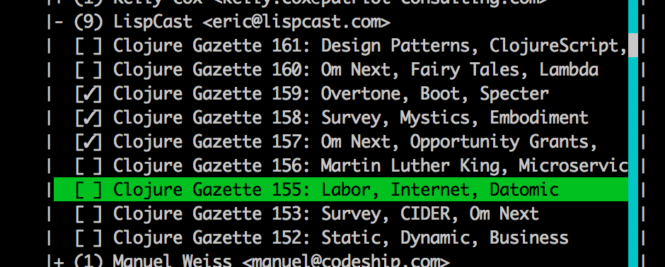
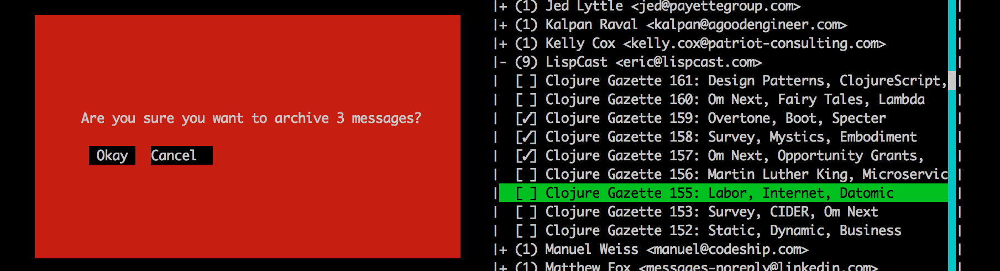

# Terminal Gmail Organizer

A nodejs based terminal application that lets you organize your inbox by sender,
select them accordingly, and archive them.  The program uses the Gmail API with
OAuth2, so you will need to follow the instructions to set it up the first time.

### Screenshot

 

### Running

_Eventually I'll create an npm package, but for now, run from source_

1. Clone this repository
1. `npm install`
1. `npm run compile`
1. `node lib/main.js`

